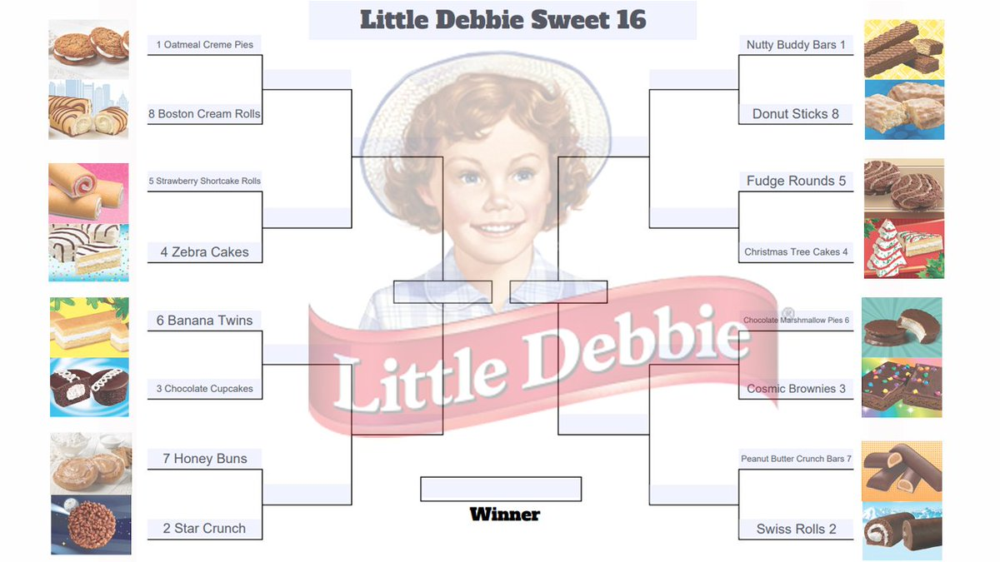

[](#)
[](#)
[](#)
# Little Debbies Sorter
An NSS Project focusing on event listeners, database managment, and other concepts in javascript.

## Installation
1. `git clone` this repository
2. run `serve` in root
3. `run json-server -p 8088 -w snacks.json` in root/api
4. go to `http://localhost:5000/src/` and register a username

## Contributing
[Jackson Goodman](https://www.github.com/jacksonrgoodman/)

## License
[MIT](https://choosealicense.com/licenses/mit/)


# Little Debbie's Collector Club

Each year, fans of _Little Debbie_ (LD) gather to tell stories about the snacks they have encountered over the last 12 months. The annual dues allow the members to enhance the very popular, very sophisticated _Little Debbie Collector Club_ (LDCC) website, which catalogs the details of their beloved LD snacks.

Currently, the LDCC members are not able to update or create new content themselves - they have always relied on us, the developers, to handle this functionality.

This year, however, they have a little more funding! So they’ve hired us to add some _new_ features to the site, like the ability to ***update*** _(PUT)_ and ***create*** _(POST)_ content, along with a few other vital requirements...

We will be hiring an intern to add numerous snacks to the DB. If you would like to be considered, please send your resume to LD at LDCC.com


## MVP Features

1. Last year, they ran out of money before the details page could be completed. The first feature is to display the full value of each property on the details page(not the id). *Hint: Use one of json-servers relationship features.*
1. Anyone visiting the site needs to log in, however there is only one admin, LD herself. Everyone else will not be an admin. This needs to be reflected in the data. *Hint: you will need to add `isAdmin: false` to the register user object.* Check your data for accuracy. 
1. The number of toppings has ***exploded***! LD has been going over the top with ***so*** many variations... LDCC can barely keep up! To help out, it has been determined that there should be ***a list of toppings*** stored in the database, and there should be some way to mix and match the toppings with the snacks!
    - Each `snack` should be able to have multiple `toppings`, _(or no toppings at all)_.
    - Each `topping` should be able to go on multiple `snacks`, _(or no snacks at all)_.
> _**Hint:**_
> _What type of relationship will this be?_
> _What tables will need to be created in the database?_
> **Be sure to share your ERD with the instruction team.**
4. The snack detail will need to display all the toppings for the one snack. Make this a comma separated list in a paragraph.
1. With the new topping tracking system, the club members would love to have the option to display snacks with particular toppings. Something like, show me all snacks with chocolate icing. The dropdown menu should read from the toppings list in the DB and be displayed in the navbar. The dropdown list of all toppings should trigger a call to DB for only those snacks and then display them.
1. For the first time in years, LD has a new type of snack - cereal. It is expected that over the next few years the trend of new snacks will continue. The club would like the ability to add a new snack type to the type table in the DB. They have also requested that the new Oatmeal Creme Pie Cereal be added immediately to the list of snacks in the DB. You will need to make an object that includes the properties of the snack table in the ERD and post it to the DB with Postman.
1. Only the admin user should have the ability to `Add A Type`. Currently the only admin is LD herself. Only display the `Add Type` if LD is logged in.

### ERD
**Before you begin any code**, use the ERD script and paste it into DBDiagram. Complete the relationships based on the MVP requirements. Share with the instruction team to get an updated `snacks.json` file.

### Bonus
1. Add the functionality to add and edit a Topping - but only for admin users.
1. Add the functionality to add and edit a snack - but only for admin users. This one is tricky since there is an option to have multiple toppings.
1. Add the functionality to edit a snack - but only for admin users. 

### Notes
1. Ask questions about the requirements to ensure you are meeting expectations.
1. After you complete each feature add, commit, push, and merge to github.
1. Share your progress with the instruction team.

## To run this project
1. run `json-server` in the API directory.
```
json-server -p 8088 -w snacks.json
```
1. `serve` the index.html on your local machine.


This exercise utilizes the following:
1. Javascript modules
1. Javascript object fundamentals: properties, key, and value
1. Adding/augmenting an object
1. Loops/iteration
1. Conditionals
1. eventListeners
1. Related data
1. Filtering data
1. DB calls: POST, PUT, GET.
